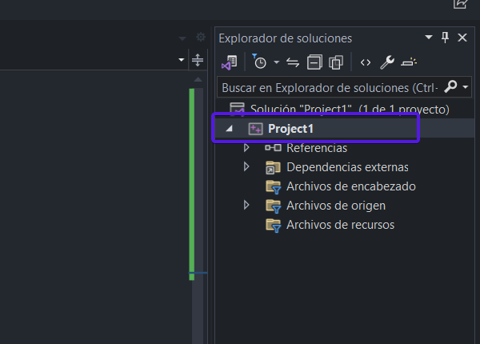
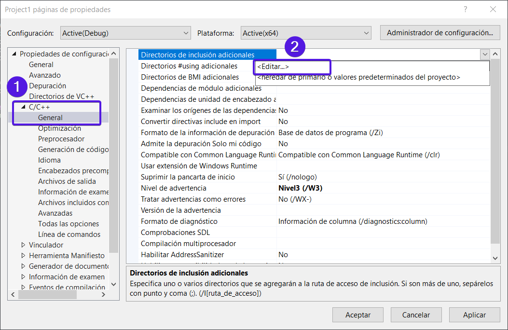
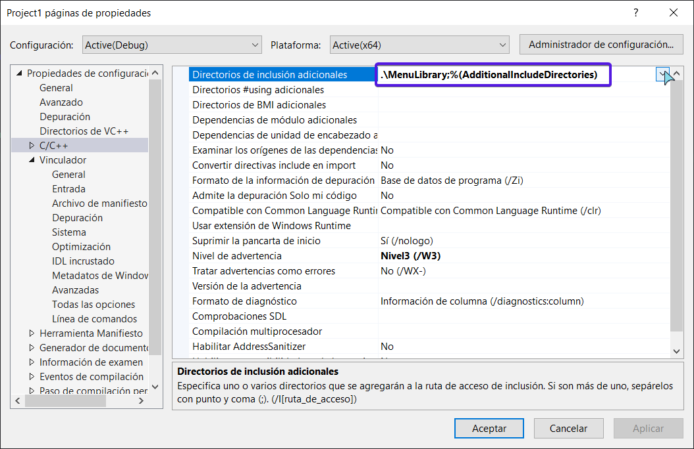
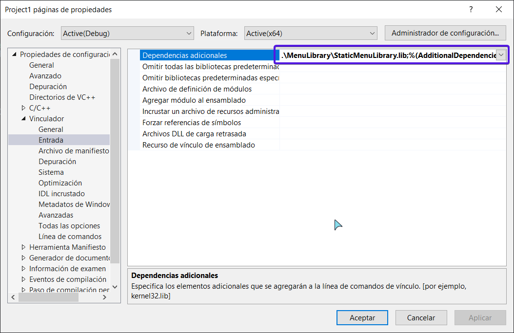
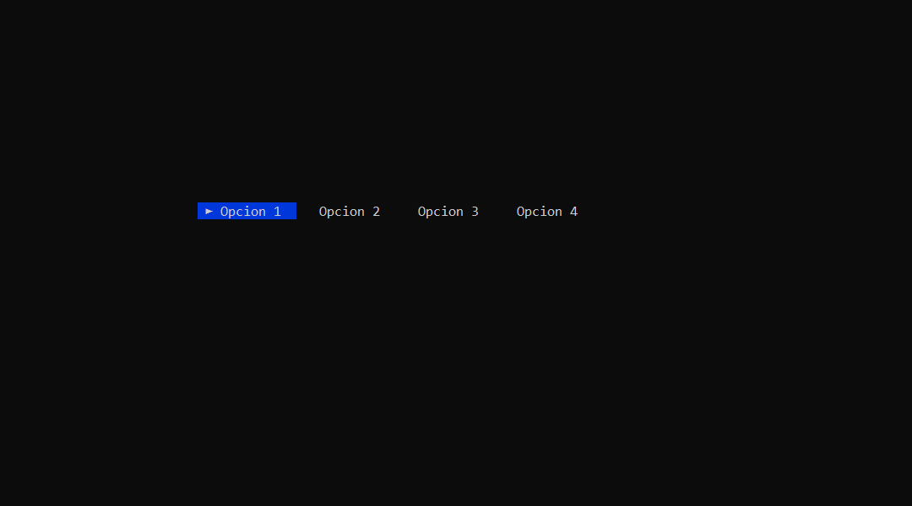
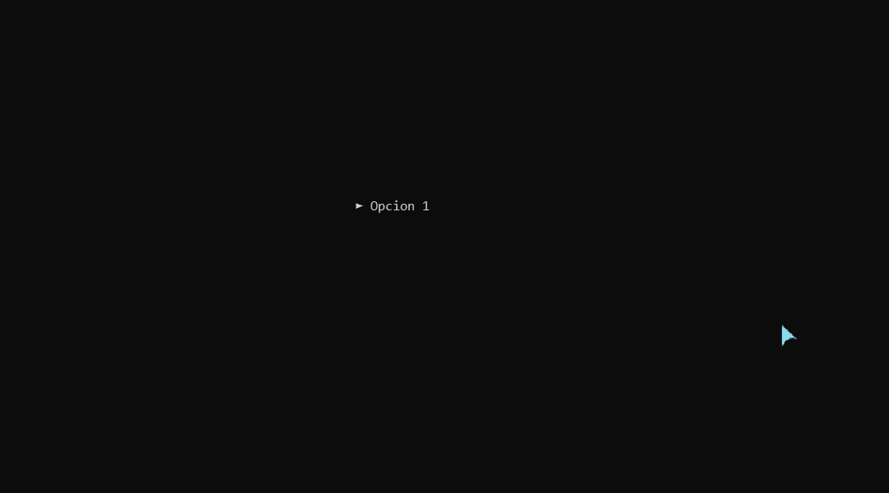
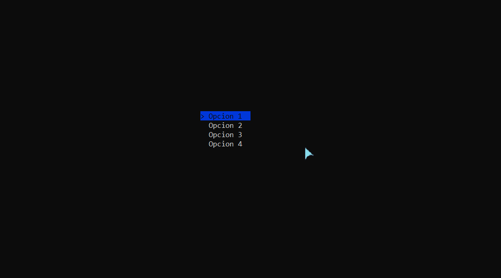

# Menú para la consola en C++ 🖥

## ℹ Instalación y Uso 
 1. Descarga la carpeta `MenuLibrary`
 2. Inclúyalo en su carpeta de trabajo
 3. Dirigite al **Explorador de soluciones** y en el proyecto da click derecho y dirigete a donde dice **propiedades** o presiona `alt+enter`
  
  
  - Ahora debes dirigirte a `propiedades > C/C++ > Directorio de inclusion adicionales` 
  
  ahí debes colocar la ruta de la carpeta MenuLibrary que debe estar dentro de la carpeta del proyecto. Ejemplo de la ruta `./MenuLibrary`
  
  - Luego, debes dirigirte a `Vinculador > Entrada > Dependencia Adicionales` y colocar la ruta en donde se encuentra el archivo `.lib`. Ejemplo: `\MenuLibrary\StaticMenuLibrary.lib`
   

 4. Finalmente solo debes incluir el archivo de encabezado `MenuLibrary.h`
  ~~~C++
  // archivo .cpp u otro .h 

    #include "Menu.h" 
  ~~~

## 📎 Descripción del programa

 El programa permite mostrar un menú de opciones amigable para el usuario, este se maneja a través de las teclas direccionales. Además, puedes modificar los colores con la librería [Colors](github.com/r0ggdev/Colores) o con sus valores numéricos, se le puede asignar diferentes caracteres ASCII al final o inicio de cada opcion, modificar la posición y la cantidad de elementos a mostrar, soporta hasta 25 opciones. 

 Con esta librería podrás crear dos tipos de menú diferentes.
 ### Menú Horizontal   

 Dentro de este apartado tenemos dos opciones
 
 1. El menú que **muestra todas las opciones** y puedes desplazarte con las teclas direccionales [➡] **Izquierda** y [⬅] **Derecha**.
    ~~~C++
    // los parámetros obligatorios son _x, _y, _num_options
    Menu::RightLeft::AllOptions menu1( _x,  _y, _num_options, _symbol_left,  _symbol_right, _txt_color, _bg_color);
    ~~~
    

 2. El menú que solo **muestra una opción a la vez**, de igual forma te puedes desplazar con las teclas direccionales [➡] **Izquierda** y [⬅] **Derecha**.
    ~~~C++
    // los parámetros obligatorios son _x, _y, _num_options
    Menu::RightLeft::SingleOption menu1( _x,  _y, _num_options, _symbol_left,  _symbol_right, _txt_color, _bg_color);
    ~~~
  
    
 
 ### Menú Vertical 
 Dentro de este apartado tenemos dos opciones
 
 1. El menú que muestra **todas las opciones** y puedes desplazarte con las teclas direccionales [⬆] **arriba** y [⬇] **arriba**.
    ~~~C++
    // los parámetros obligatorios son _x, _y, _num_options
    Menu::UpDown::SingleOption menu1( _x,  _y, _num_options, _symbol_left,  _symbol_right, _txt_color, _bg_color);
    ~~~
    
 
 2. El menú que solo **muestra una opción a la vez**, de igual forma te puedes desplazar con las teclas direccionales [⬆] **arriba** y [⬇] **arriba**.
      ~~~C++
    // los parámetros obligatorios son _x, _y, _num_options
    Menu::UpDown::SingleOption menu1( _x,  _y, _num_options, _symbol_left,  _symbol_right, _txt_color, _bg_color);
    ~~~
    
 

## ⚠ Uso
Para hacer el uso de esta libreria tenemos que elegir el tipo de menu que queremos usar, luego, tenemos que definir las opciones dentro de un arreglo de tipo `const char*`, luego las pasamos con la función `addOptions(_options,...)`. 

Luego debemos pasarle las funciones que se ejecutaran al momento de seleccionar alguna opcion `addOptions(_options,_functions)`.
### Ejemplo funcional
~~~C++
  #include"MenuLibrary.h"

  using namespace std;

  int main() {

    MenuLibrary::UpDown::AllOptions menu(10, 20, 4);
    
    const char* options[]{ "Opcion 1", "Opcion 2", "Opcion 3", "Salir" };
    
    vector<function<void()>> functionsMenu = {
       {cout << "Seleccionaste la opcion 1"; },
       {cout << "Seleccionaste la opcion 2"; },
       {cout << "Seleccionaste la opcion 3"; },
       {exit(0); }
    };
    
    menu.addOptions(options, functionsMenu);

    while (true) {
      menu.showMenu();
    }

    return 0;
  }
~~~

### Ejemplo genérico

~~~C++
    // se incluye la libreria 
    #include "Menu.h" 

    // los parámetros obligatorios son _x, _y, _num_options
    Menu::RightLeft::AllOptions menu1( _x,  _y, _num_options, _symbol_left,  _symbol_right, _txt_color, _bg_color);

    // si existen parametros los declarmos en el main
    int param1 = 10;
	int param2 = 20;
	char param3 = 'A';
	char param4 = 'J';

	// se crea un vector con las funciones que se ejcutaran en el menu, se hace usos de lambda
	vector<function<void()>> functions = { 
		[param1, param2]() { exampleFunction1(param1, param2); },
		[param3, param4]() { exampleFunction2(param3, param4); },
		 { std::cout << "Option 3 selected!\n"; },
		 { std::cout << "Option 4 selected!\n"; }

        // las funciones "exampleFunction1", "exampleFunction2" son funciones voids que se declaran fuera del main con normalidad.
	};

    // declaramos las opciones
    const char* options[] = { "Opcion 1","Opcion 2", "Opcion 3","Opcion 4" };
    
    // agregamos las opciones
    menu1.addOptions(options, functions);

	// se crea un bucle para el menu
	while (true) {
		menu1.showMenu();
	}
~~~